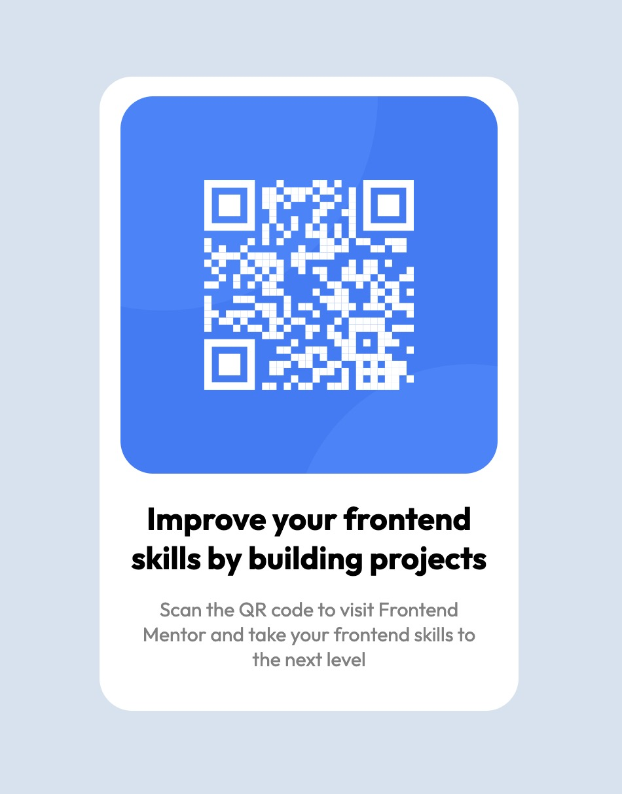

# Frontend Mentor - QR code component solution

This is a solution to the [QR code component challenge on Frontend Mentor](https://www.frontendmentor.io/challenges/qr-code-component-iux_sIO_H). Frontend Mentor challenges help you improve your coding skills by building realistic projects.

## Table of contents

- [Overview](#overview)
  - [Screenshot](#screenshot)
  - [Links](#links)
- [My process](#my-process)
  - [Built with](#built-with)
  - [What I learned](#what-i-learned)
  - [Continued development](#continued-development)
- [Author](#author)

## Overview

### Screenshot



### Links

- Solution URL: [Frontend Mentor link](https://www.frontendmentor.io/solutions/simple-and-flawed-html-and-css-implementation-of-qr-code-challenge-Y_NjLSwGzt)
- Live Site URL: [Github Pages](https://shiguita.github.io/FM-QR_Component/)

## My process

This challenge consisted mostly of CSS styling in order to get the html to look as desired. At first I organised the content in all the `<divs>` I thought necessary and proceeded to write the CSS. I did try different approaches to centering the element to try and understand each method.

### Built with

- HTML5 markup
- CSS custom properties
- Flexbox

### What I learned

Overall I think the biggest hurdle will be learning how to position elements, I hope to get better with every project I work on.

```html
<div class="card">
  
  <h1>Improve your frontend skills by building projects</h1>
  <p>
    Scan the QR code to visit Frontend Mentor and take your frontend skills to
    the next level
  </p>
</div>
```

```css
.card {
  text-align: center;
  align-self: center;
  background-color: white;
  border-radius: 25px;
  max-width: 40vh;
  margin: 20% 0;
  padding: 15px 0;
}
```

I think that while it works, there must be a better way to set the size of the "card".

### Continued development

I want to keep on practising my CSS skills and I hope to one day be more confident when coming up with implementations of certain designs. I'm conscious of my lack of understanding of positioning, sizing and more complex ideas. I'll keep working on projects that focus on this topics and gain more experience each time.

## Author

- Frontend Mentor - [@shiguita](https://www.frontendmentor.io/profile/shiguita)
